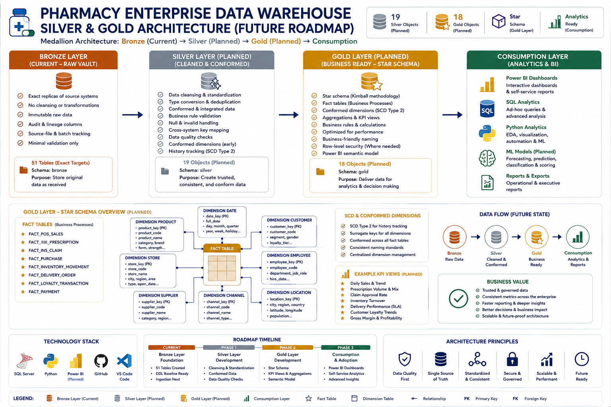
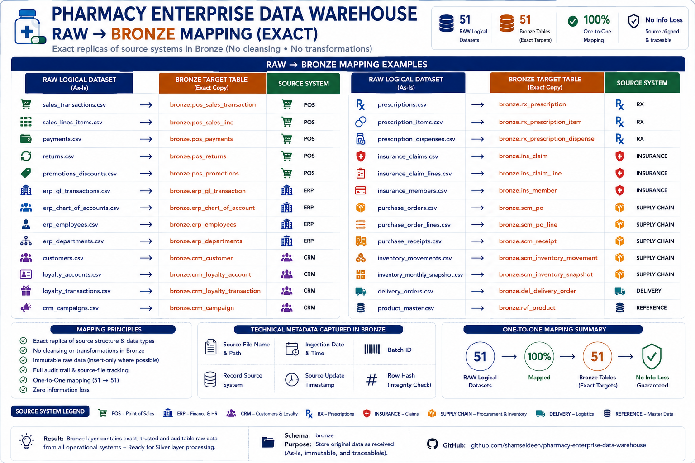
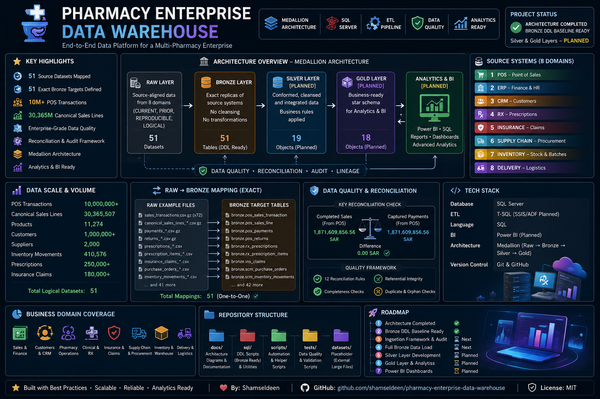
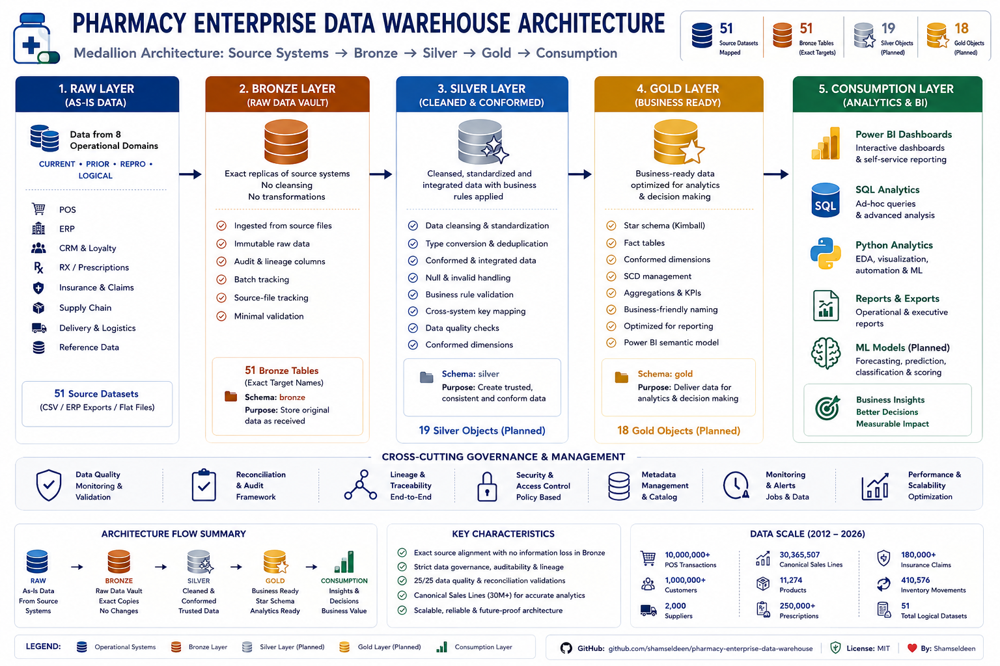
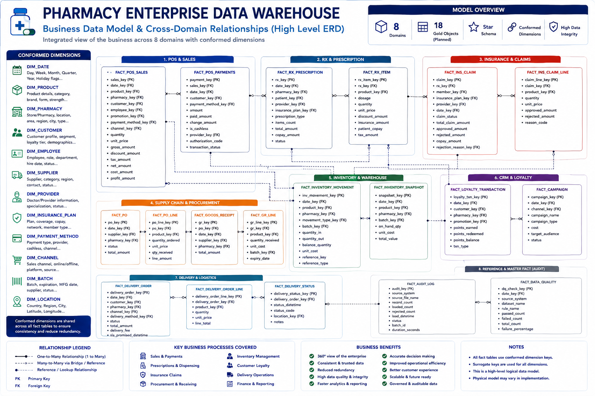
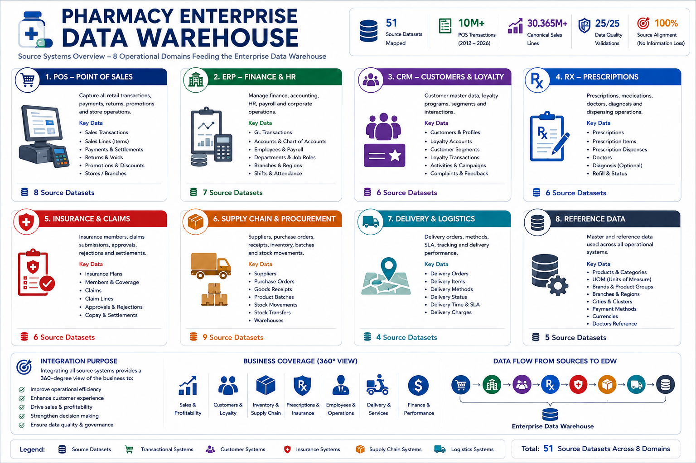
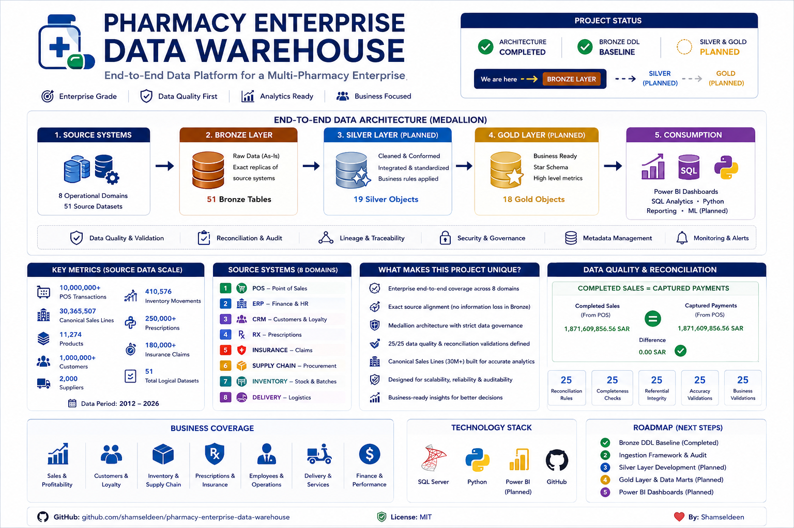
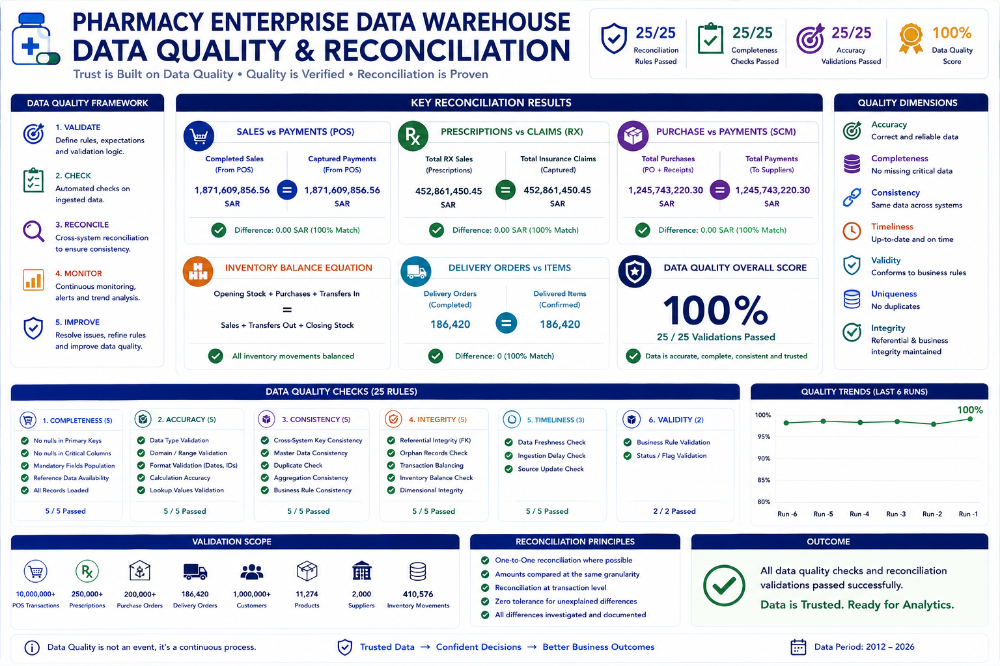

# 💊 Pharmacy Enterprise Data Warehouse


> **An enterprise-scale retail pharmacy data warehouse project that models the full path from operational source data to governed analytical data using SQL Server, Medallion Architecture, data-quality controls, reconciliation, dimensional modeling, and BI.**

This project is designed as a realistic portfolio implementation rather than a single-dashboard demo. It integrates pharmacy retail operations across **sales, customers, products, prescriptions, insurance, procurement, suppliers, inventory, workforce, branch operations, and delivery** into one analytical platform.



---

## 📌 Project Status

| Area | Status |
|---|---|
| Business scope & source-system design | ✅ Complete |
| Synthetic RAW business dataset | ✅ Complete / locked |
| Cross-domain RAW validation | ✅ 25 / 25 checks passed |
| Metadata & business data catalog | ✅ Complete |
| Architecture, ERD & lineage | ✅ Complete |
| Bronze DDL baseline (`sql/bronze/ddl_bronze.sql`) | ✅ Present in repository |
| Bronze source-to-target redesign / alignment | ✅ Complete |
| Bronze SQL Server ingestion | 🚧 Next implementation phase |
| Silver layer | ⏳ Planned |
| Gold dimensional layer | ⏳ Planned |
| Power BI semantic model & dashboards | ⏳ Planned |
| Python analytics / forecasting | ⏳ Planned |

**Current milestone:** `RAW → Bronze implementation`

---

## 🎯 Project Objective

The goal is to build a reproducible **enterprise analytical platform for a multi-branch retail pharmacy business**.

The warehouse is intended to support questions such as:

- Which branches, regions, categories, and products drive revenue and profitability?
- How do discounts, returns, and product mix affect margin?
- Which suppliers perform best on fill rate, lead time, and OTIF?
- Where are stockouts, overstock, dead stock, and near-expiry risks concentrated?
- How do prescriptions and insurance claims behave across products, doctors, plans, and branches?
- What customer, workforce, and operational patterns explain branch performance?
- How can trusted warehouse data feed executive Power BI reporting and advanced Python analytics?

---

## 📊 Dataset Scale

The project uses a large synthetic operational dataset designed for realistic warehousing and analytics workloads.

| Dataset | Scale |
|---|---:|
| Product master | **11,274 SKUs** |
| Pharmacy branches | **1,000** |
| Employees | **10,000** |
| Customers | **1,000,000** |
| Doctors | **20,000** |
| Suppliers | **2,000** |
| Warehouses | **30** |
| POS transaction headers | **10,000,000** |
| Completed POS transactions | **9,890,375** |
| Canonical sales lines | **30,365,507** |
| Purchase orders | **25,000** |
| Purchase-order lines | **82,140** |
| Purchase receipts | **80,478** |
| Product batches | **40,000** |
| Inventory movements | **410,576** |
| Prescriptions | **100,000** |
| Prescription items | **203,899** |
| Insurance claims | **75,000** |
| Insurance claim lines | **153,098** |

> **Note:** the 30.3M canonical sales-line fact has been validated and financially reconciled, but the large standalone materialized file is not committed directly to the portable repository. Its materialization rule and validation evidence are documented separately.

---

## 🏗️ Architecture



The project follows a **Medallion Architecture**:

```text
Operational / Synthetic Source Systems
                │
                ▼
              RAW
        source evidence
                │
                ▼
             BRONZE
   source-aligned ingestion + audit
                │
                ▼
             SILVER
 cleaning + standardization + conformance
                │
                ▼
              GOLD
 dimensions + facts + analytical marts
                │
        ┌───────┼────────┐
        ▼       ▼        ▼
     Power BI   SQL     Python
```

### Layer Responsibilities

| Layer | Responsibility |
|---|---|
| **RAW** | Preserve source-system evidence and original business records |
| **Bronze** | Load source-aligned tables with technical metadata and auditability |
| **Silver** | Clean, standardize, validate, deduplicate, and conform business entities |
| **Gold** | Build dimensional models, KPI-ready facts, dimensions, and marts |
| **Consumption** | Power BI, SQL analysis, Python analytics, forecasting |

---

## 🏢 Source Domains



The warehouse is modeled around multiple operational domains instead of one flat sales file.

| Domain | Main Business Data |
|---|---|
| **Reference / Master** | Regions, cities, products, reference codes |
| **ERP / Branch Operations** | Pharmacies, employees, job roles, shifts, operating hours, branch expenses |
| **POS / Finance** | Transactions, sales lines, payments, returns |
| **CRM & Loyalty** | Customers, loyalty accounts, consent history, customer-service interactions |
| **Prescription / RX** | Prescriptions, prescription items, dispensing events, doctors |
| **Insurance** | Insurance plans, memberships, eligibility, claims, claim lines |
| **Supply Chain** | Suppliers, contracts, warehouses, purchase orders, receipts, batches |
| **Inventory** | Inventory movements, snapshots, cycle counts, transfers |
| **Delivery** | Delivery orders and delivery methods |

---

## 🧱 RAW → Bronze Design



A Bronze DDL baseline already exists in the repository at [`sql/bronze/ddl_bronze.sql`](sql/bronze/ddl_bronze.sql).

It creates source-aligned Bronze tables and explicitly defers cleansing and business transformations to Silver.

The next implementation step is to reconcile the existing DDL with the finalized **51-table source-of-truth mapping**, then build auditable loading and validation.

### Example Source-to-Bronze Mapping

```text
sales_transactions
    → bronze.pos_sales_transaction

canonical_sales_lines
    → bronze.pos_sales_line

payments
    → bronze.pos_payments

returns
    → bronze.pos_returns

product_master
    → bronze.ref_products

prescriptions
    → bronze.rx_prescriptions

insurance_claims
    → bronze.ins_claims

purchase_orders
    → bronze.scm_purchase_orders

inventory_movements
    → bronze.scm_inventory_movements
```

Every Bronze table is designed to include technical metadata such as:

```text
_source_file
_ingestion_ts
_batch_id
_row_hash
```

Bronze is intentionally **not** the business-reporting layer. Business transformations are deferred to Silver.

---

## 🧪 Data Quality & Reconciliation



Data quality is treated as part of the architecture, not as a final dashboard check.

The RAW business model passed **25 / 25 cross-domain validation checks**.

Key controls include:

- Unique product identifiers and barcodes
- Positive product prices
- Referential integrity across key business entities
- Exclusion of cancelled/voided POS sales from canonical revenue
- Completed-sales to captured-payment reconciliation
- Prescription-to-customer / doctor / product validation
- Insurance claim and plan validation
- `approved_amount <= claimed_amount`
- Purchase-order to supplier / warehouse integrity
- Receipt to purchase-order-line integrity
- Product-batch to product / supplier integrity
- Balanced inventory transfer OUT / IN pairs
- Valid inventory snapshot equation
- Non-negative canonical closing inventory

### Financial Reconciliation

```text
Completed sales     = 1,871,609,856.56 SAR
Captured payments   = 1,871,609,856.56 SAR
Difference          =             0.00 SAR
```

This reconciliation is one of the main controls protecting downstream profitability and KPI analysis.

---

## 🔗 Core Business Flow



```text
CUSTOMERS / PHARMACIES / EMPLOYEES
                │
                ▼
        SALES TRANSACTIONS
                │
        ┌───────┼────────┐
        ▼       ▼        ▼
   SALES LINES PAYMENTS RETURNS
        │
        ▼
     PRODUCTS


CUSTOMERS + DOCTORS + PHARMACIES
                │
                ▼
         PRESCRIPTIONS
                │
                ▼
      PRESCRIPTION ITEMS
                │
                ▼
        INSURANCE CLAIMS
                │
                ▼
       INSURANCE CLAIM LINES


SUPPLIERS + WAREHOUSES
                │
                ▼
        PURCHASE ORDERS
                │
                ▼
      PURCHASE ORDER LINES
                │
                ▼
       PURCHASE RECEIPTS
                │
                ▼
      INVENTORY MOVEMENTS
                │
                ▼
      INVENTORY SNAPSHOTS
```

---

## 🥈 Planned Silver Layer



> **Status: PLANNED — not yet implemented.**

The Silver layer will convert source-aligned Bronze tables into trusted, conformed entities.

### Planned Silver Objects

```text
silver.product
silver.customer
silver.pharmacy
silver.employee
silver.doctor

silver.sales_transaction
silver.sales_line

silver.prescription
silver.insurance_member
silver.insurance_claim

silver.supplier
silver.procurement
silver.batch

silver.inventory_movement
silver.inventory_snapshot
```

Silver will own:

- Standardized data types and naming
- Canonical business statuses
- Explicit deduplication rules
- Null and invalid-value treatment
- Conformed entity keys
- Referential validation
- Monetary and date normalization
- Data-quality exception handling

---

## 🥇 Planned Gold Layer

> **Status: PLANNED — not yet implemented.**

The Gold layer will expose business-ready dimensional models.

### Planned Conformed Dimensions

```text
gold.dim_date
gold.dim_pharmacy
gold.dim_product
gold.dim_customer
gold.dim_employee
gold.dim_doctor
gold.dim_supplier
gold.dim_insurance_plan
```

### Planned Analytical Facts

```text
gold.fact_sales
gold.fact_return
gold.fact_prescription
gold.fact_insurance_claim
gold.fact_purchase
gold.fact_inventory_movement
gold.fact_inventory_snapshot
gold.fact_delivery
gold.fact_customer_service
gold.fact_branch_expense
```

The final grain, surrogate-key strategy, SCD handling, and analytical relationships will be fixed during Silver/Gold implementation rather than prematurely enforced in Bronze.

---

## 📈 Business Analytics Coverage

The completed warehouse is designed to support:

| Area | Example Analytics |
|---|---|
| **Executive** | Revenue, profit, growth, margin, regional performance |
| **Sales** | ATV, UPT, product/category mix, discount impact, returns |
| **Branches** | Branch ranking, same-store growth, labor productivity |
| **Products** | Revenue, units, margin, brand/generic mix |
| **Customers** | Retention, frequency, RFM, CLV, loyalty behavior |
| **Inventory** | Stock turnover, DOI, OOS, dead stock, expiry risk |
| **Procurement** | Supplier spend, fill rate, OTIF, lead time |
| **RX** | Prescription volume, dispensing, doctor/product analysis |
| **Insurance** | Approval rate, rejection reasons, payer performance |
| **Workforce** | Sales per employee, labor hours, staffing efficiency |
| **Delivery** | SLA, delivery time, cost per order |
| **Customer Experience** | Complaints, resolution time, service quality |

---

## 🛠️ Technology Stack



| Technology | Purpose |
|---|---|
| **SQL Server** | Enterprise data warehouse |
| **T-SQL** | DDL, ETL/ELT, validation, analytics |
| **SSMS** | SQL Server development |
| **Python** | Data generation, validation, analytics |
| **Pandas** | Data analysis and validation |
| **Power BI** | Planned semantic model and executive dashboards |
| **DAX** | Planned analytical measures |
| **Git / GitHub** | Version control and portfolio delivery |
| **Draw.io / Architecture Diagrams** | ERD, lineage and data-flow design |
| **VS Code** | Development environment |

---

## 📂 Repository Structure

The current GitHub repository contains:

```text
pharmacy-enterprise-data-warehouse/
│
├── datasets/
│   └── placeholder
│
├── docs/
│   ├── architecture/
│   └── placeholder
│
├── scripts/
│
├── sql/
│   ├── setup/
│   ├── bronze/
│   │   ├── ddl_bronze.sql
│   │   └── placeholder
│   ├── silver/
│   └── gold/
│
├── tests/
│
├── LICENSE
└── README.md
```

The repository will expand as Bronze ingestion, Silver transformations, Gold models, tests, BI assets, and supporting documentation are implemented.

Large generated datasets are intentionally stored outside the GitHub repository.

At the current repository state, `datasets/` contains only a placeholder; the warehouse dataset itself is maintained separately.

GitHub is used for SQL, architecture, documentation, tests, scripts, and reproducibility artifacts.

---

## 🗺️ Project Roadmap

```text
✅ Business requirements & scope
        ↓
✅ Enterprise source-system design
        ↓
✅ Synthetic RAW dataset
        ↓
✅ RAW quality & reconciliation
        ↓
✅ Metadata & data catalog
        ↓
✅ Architecture / ERD / lineage
        ↓
✅ RAW → Bronze source mapping
        ↓
✅ Bronze DDL baseline
        ↓
▶ Bronze ingestion + audit framework
        ↓
⏳ Bronze validation
        ↓
⏳ Silver cleaning & conformance
        ↓
⏳ Gold dimensional model
        ↓
⏳ KPI / analytical SQL layer
        ↓
⏳ Power BI semantic model & dashboards
        ↓
⏳ Python analytics / forecasting
```

---

## 📚 Documentation

### Visual Architecture Set

| # | Visual | Purpose |
|---:|---|---|
| **01** | Project Overview | Executive introduction, project scale and status |
| **02** | Source Systems Overview | Operational domains feeding the warehouse |
| **03** | End-to-End Architecture | RAW → Bronze → Silver → Gold → Consumption |
| **04** | RAW → Bronze Mapping | Source-aligned ingestion and technical metadata |
| **05** | Business ERD / Cross-Domain | Core business relationships across domains |
| **06** | Data Quality & Reconciliation | Validation controls and financial/operational gates |
| **07** | Planned Silver & Gold | Future conformed and dimensional architecture |
| **08** | Technology / Repository / Roadmap | Stack, delivery structure and implementation path |

Architecture visuals are stored under:

```text
docs/architecture/
```

The repository will continue to integrate engineering documentation including:

- Business ERD
- Source-to-target mapping
- Metadata and data dictionary
- Business rules
- Data-quality rules
- Reconciliation logic
- Data lineage
- Implementation documentation

---

## ⚠️ Data & Provenance Disclaimer

This is a **portfolio and learning project built on synthetic operational data**.

Some product records may use real-world brand names or standard medicine concepts to improve business realism.

Generated combinations of SKU, barcode, pack, price, transaction, prescription, insurance, customer, employee, supplier, and operational data are synthetic unless explicitly documented otherwise.

The dataset must not be interpreted as an official manufacturer, retailer, payer, or regulatory registry.

---

## 👤 Author

### Shamseldeen Ismaiil

Retail pharmacy professional with more than 10 years of operational experience, building practical expertise in:

**Data Analytics • Business Intelligence • SQL • Python • Power BI • Data Warehousing**

The project combines technical data skills with practical domain understanding across:

**Pharmacy Operations • Retail • Sales • Insurance • Inventory • Customer Service**

---

## 📄 License

This project is released under the [MIT License](LICENSE).

---

### ⭐ Project Vision

> Build a realistic, auditable, and scalable pharmacy analytics platform that demonstrates the complete journey from complex operational data to trusted business intelligence.
