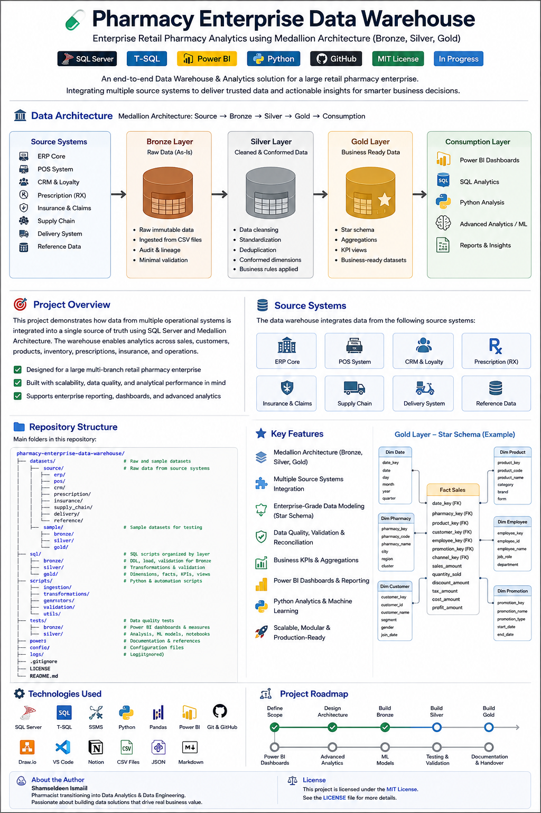
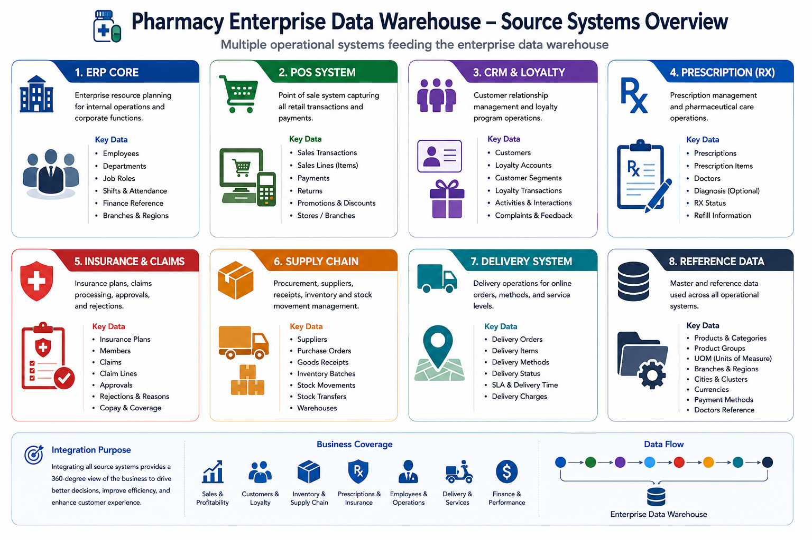
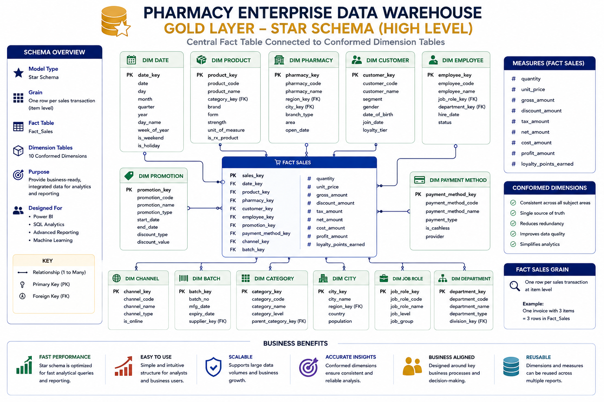

# 💊 Pharmacy Enterprise Data Warehouse


> **Enterprise Retail Pharmacy Data Warehouse using SQL Server and Medallion Architecture (Bronze, Silver, Gold), integrating ERP, POS, CRM, prescriptions, insurance, supply chain, inventory, delivery, customers, employees, products, and pharmacy branches for advanced analytics and executive reporting.**

---

# 🏗️ Data Architecture

The project follows a modern **Medallion Architecture**:

**Source Systems → Bronze → Silver → Gold → Consumption**



### 🥉 Bronze Layer — Raw Data

The Bronze layer stores source data in its original or near-original form.

- Raw CSV ingestion
- Source-aligned tables
- Minimal transformation
- Immutable raw history
- Source-file tracking
- Batch tracking
- Ingestion timestamps
- Row hashes
- Initial technical validation

### 🥈 Silver Layer — Cleaned & Conformed Data

The Silver layer converts raw operational data into trusted enterprise data.

- Data cleansing
- Data standardization
- Type conversion
- Deduplication
- Null handling
- Invalid-value handling
- Business-rule validation
- Cross-system key mapping
- Data-quality checks
- Conformed business entities
- Rejected-record handling

### 🥇 Gold Layer — Business-Ready Data

The Gold layer contains analytical models optimized for reporting.

- Star schemas
- Fact tables
- Conformed dimensions
- Slowly Changing Dimensions
- Analytical aggregations
- KPI views
- Business-ready datasets
- Power BI reporting models

### Data Flow

```text
                    SOURCE SYSTEMS
                          │
        ┌─────────────────┼─────────────────┐
        │                 │                 │
       ERP               POS               CRM
        │                 │                 │
        ├──────────── Prescription ─────────┤
        │                 │                 │
    Insurance        Supply Chain       Delivery
        │                 │                 │
        └──────── Reference Data ───────────┘
                          │
                          ▼
                     🥉 BRONZE
                    Raw / Immutable
                          │
                          ▼
                     🥈 SILVER
              Clean / Standardized / Conformed
                          │
                          ▼
                      🥇 GOLD
             Dimensions / Facts / KPIs
                          │
             ┌────────────┼────────────┐
             ▼            ▼            ▼
          Power BI       SQL         Python
                                       │
                                       ▼
                              Machine Learning
```

---

# 📖 Project Overview

This project demonstrates an end-to-end **Data Engineering, Data Warehousing, Analytics, and Business Intelligence solution** for a large retail pharmacy enterprise.

The simulated enterprise contains:

- Multiple regions
- Multiple cities
- Large numbers of pharmacy branches
- Customers
- Employees
- Pharmacists
- Products
- Suppliers
- Product batches
- Prescriptions
- Insurance claims
- Sales transactions
- Inventory movements
- Purchase orders
- Loyalty activity
- Promotions
- Deliveries

The objective is not simply to create a sales dashboard.

The objective is to build an **enterprise analytical platform** capable of supporting management decisions across the entire retail pharmacy business.

---

# 🎯 Project Objectives

The project is designed to demonstrate practical skills in:

- SQL Development
- Data Engineering
- Data Warehousing
- ETL / ELT
- Data Modeling
- Dimensional Modeling
- Data Quality
- Data Validation
- Business Intelligence
- Data Analytics
- Power BI
- Python
- Machine Learning
- Git & GitHub
- Technical Documentation

---

# 🏢 Source Systems

Instead of using one flat CSV dataset, the project simulates multiple operational systems.



| Source System | Business Area | Main Data |
|---|---|---|
| 🏢 **ERP Core** | Enterprise Operations | Employees, job roles, shifts, finance reference |
| 🛒 **POS System** | Retail Sales | Transactions, sales lines, payments, returns, promotions |
| 👥 **CRM & Loyalty** | Customer Management | Customers, loyalty, segmentation, customer service |
| 💊 **Prescription / RX** | Pharmacy Operations | Prescriptions, prescription items, doctors |
| 🛡️ **Insurance & Claims** | Insurance | Plans, claims, claim lines, approvals and rejections |
| 🚚 **Supply Chain** | Procurement & Inventory | Suppliers, purchasing, receipts, batches, stock movements |
| 📦 **Delivery Operations** | Last Mile | Delivery orders, methods, SLA and fulfillment |
| 🌍 **Reference Data** | Master / External | Branches, regions, currencies, products and reference data |

---

# 🔄 ETL / ELT Pipeline

## Source → Bronze

Source-system data is loaded into Bronze without applying major business transformations.

Example:

```text
datasets/source/pos/
        │
        ▼
bronze.pos_sales_transaction
bronze.pos_sales_line
bronze.pos_returns
```

Bronze technical metadata includes:

```text
_source_file
_ingestion_ts
_batch_id
_row_hash
```

---

## Bronze → Silver

Silver performs the major data-quality and integration work.

```text
RAW CUSTOMER DATA
       │
       ├── Clean
       ├── Standardize
       ├── Deduplicate
       ├── Validate
       └── Conform
              │
              ▼
       silver.customer
```

Silver responsibilities include:

- Cleaning
- Standardization
- Deduplication
- Data-type correction
- Missing-value handling
- Referential validation
- Business-rule validation
- Cross-system integration
- Master-data conformance

---

## Silver → Gold

Gold transforms trusted Silver entities into dimensional models.

```text
silver.customer ──────────────► dim_customer

silver.product ───────────────► dim_product

silver.pharmacy ──────────────► dim_pharmacy

silver.employee ──────────────► dim_employee

silver.sales ─────────────────► fact_sales
```

---

# ⭐ Gold Dimensional Model



The Gold layer will use **conformed dimensions** shared across multiple business processes.

## Dimensions

```text
dim_date
dim_time

dim_pharmacy
dim_region

dim_product
dim_category
dim_batch

dim_customer
dim_customer_segment

dim_employee
dim_job_role

dim_supplier
dim_doctor

dim_insurance
dim_insurance_plan

dim_payment_method
dim_channel

dim_promotion
dim_campaign

dim_warehouse
dim_shift

dim_return_reason
dim_currency
dim_delivery_method
```

## Fact Tables

```text
fact_sales
fact_sales_transaction

fact_returns

fact_inventory_snapshot
fact_inventory_movement

fact_purchase
fact_purchase_receipt

fact_stock_transfer

fact_prescription
fact_prescription_item

fact_insurance_claim
fact_insurance_claim_line

fact_customer_activity
fact_loyalty_transaction
fact_customer_service

fact_employee_performance
fact_employee_attendance

fact_promotion_performance

fact_delivery

fact_branch_operations
fact_branch_expense
```

---

# 💰 Sales & Profitability Analytics

The warehouse will support:

- Gross Sales
- Net Revenue
- Discounts
- Cost of Goods Sold
- Gross Profit
- Gross Margin %
- Contribution Profit
- Contribution Margin %
- Revenue Growth
- Month-over-Month Growth
- Year-over-Year Growth
- Average Transaction Value
- Units per Transaction
- Sales Trends
- Product Mix
- Category Mix

---

# 🏪 Branch & Regional Analytics

Management will be able to drill down through:

```text
Company
   ↓
Region
   ↓
City
   ↓
Cluster
   ↓
Pharmacy Branch
```

KPIs include:

- Revenue per Branch
- Profit per Branch
- Branch Growth
- Branch Ranking
- Same-Store Sales Growth
- Sales per Employee
- Revenue per Labor Hour
- Sales per Square Meter
- Contribution Profit
- Regional Performance

---

# 💊 Product Analytics

Product analytics will include:

- Product Revenue
- Units Sold
- Product Profit
- Product Margin %
- Category Performance
- Generic vs Brand Mix
- Product Ranking
- Price Realization
- Discount Impact
- Product Growth
- Product Trends

---

# 👥 Customer & Loyalty Analytics

Customer analytics will include:

- Active Customers
- New Customers
- Returning Customers
- Repeat Purchase Rate
- Purchase Frequency
- Customer Retention
- Customer Churn
- Customer Lifetime Value
- Loyalty Participation
- Points Earned
- Points Redeemed

## RFM Analysis

Customers can be segmented using:

```text
R = Recency
F = Frequency
M = Monetary Value
```

Potential segments:

```text
Champions
VIP
Loyal
Potential Loyalists
Regular
New
At Risk
Lost
```

---

# 📦 Inventory Analytics

Inventory analytics will support:

- Inventory Value
- Stock Turnover
- Days of Inventory
- Out-of-Stock Rate
- Overstock
- Dead Stock
- Near-Expiry Inventory
- Expiry Loss
- Damaged Stock
- Shrinkage
- Batch Traceability
- Stock Transfers

---

# 🚚 Procurement & Supplier Analytics

Supplier analytics will include:

- Purchase Value
- Supplier Spend
- Supplier Fill Rate
- On-Time Delivery
- OTIF
- Lead Time
- Purchase Price Variance
- Contract Compliance
- Supplier Performance
- Supplier Ranking

---

# 👨‍⚕️ Prescription Analytics

The prescription domain supports:

- Prescription Volume
- Prescription Value
- Prescription Items
- Prescribing Doctor Analysis
- Product Dispensing
- Refill Analysis
- Prescription Status
- Insurance-linked Prescriptions

---

# 🛡️ Insurance Analytics

Insurance analytics includes:

- Number of Claims
- Claimed Amount
- Approved Amount
- Rejected Amount
- Approval Rate
- Rejection Rate
- Customer Copay
- Insurance Revenue
- Claim Status
- Rejection Reasons
- Insurance Company Performance

---

# 👨‍💼 Employee & Workforce Analytics

The workforce domain will support:

- Sales per Employee
- Transactions per Employee
- Revenue per Labor Hour
- Employee Productivity
- Working Hours
- Overtime
- Absence
- Branch Staffing Efficiency
- Customer-Service Performance

---

# 📣 Promotion Analytics

Promotional analytics includes:

- Promotion Revenue
- Promotion Discount
- Promotion Uplift
- Incremental Sales
- Margin Impact
- Promotion ROI
- Customer Response
- Product Response

---

# 🚚 Delivery Analytics

Delivery KPIs include:

- Delivery Orders
- Delivery Revenue
- Average Delivery Time
- Delivery SLA %
- Late Delivery %
- Delivery Cost
- Delivery Cost per Order
- Digital Channel Share

---

# 😊 Customer Experience Analytics

Customer-service metrics include:

- Customer Satisfaction
- Complaint Rate
- First Contact Resolution
- Average Resolution Time
- Complaints per 1,000 Transactions
- Branch Customer Experience Score

---

# 🧪 Data Quality Framework

Data quality is built into the pipeline.

Validation includes:

```text
Required Field Checks
        ↓
Data Type Validation
        ↓
Duplicate Detection
        ↓
Business Key Validation
        ↓
Referential Integrity
        ↓
Business Rules
        ↓
Financial Reconciliation
        ↓
Source-to-Target Validation
```

Example checks:

- Duplicate transaction IDs
- Orphan sales lines
- Invalid product/batch combinations
- Invalid employee/branch combinations
- Sales before branch opening
- Returns without original sales lines
- Transaction header vs line reconciliation
- Invalid claim amounts
- Invalid inventory balances

---

# 📂 Repository Structure

```text
pharmacy-enterprise-data-warehouse/
│
├── datasets/
│   ├── source/
│   │   ├── erp/
│   │   ├── pos/
│   │   ├── crm/
│   │   ├── prescription/
│   │   ├── insurance/
│   │   ├── supply_chain/
│   │   ├── delivery/
│   │   └── reference/
│   │
│   └── sample/
│       ├── bronze/
│       │   └── placeholder
│       ├── silver/
│       │   └── placeholder
│       └── gold/
│           └── placeholder
│
├── sql/
│   ├── bronze/
│   │   ├── ddl/
│   │   │   └── ddl_bronze.sql
│   │   ├── load/
│   │   │   └── placeholder
│   │   └── validation/
│   │       └── placeholder
│   │
│   ├── silver/
│   │   ├── ddl/
│   │   │   └── placeholder
│   │   ├── transformations/
│   │   │   └── placeholder
│   │   └── validation/
│   │       └── placeholder
│   │
│   └── gold/
│       ├── ddl/
│       │   └── placeholder
│       ├── dimensions/
│       │   └── placeholder
│       ├── facts/
│       │   └── placeholder
│       ├── aggregations/
│       │   └── placeholder
│       ├── kpi_views/
│       │   └── placeholder
│       └── validation/
│           └── placeholder
│
├── scripts/
│   ├── ingestion/
│   │   └── placeholder
│   ├── transformations/
│   │   └── placeholder
│   ├── generators/
│   ├── validation/
│   └── utils/
│       └── placeholder
│
├── tests/
│   ├── bronze/
│   │   └── placeholder
│   ├── silver/
│   │   └── placeholder
│   ├── gold/
│   │   └── placeholder
│   └── reconciliation/
│       └── placeholder
│
├── powerbi/
│   ├── dashboard/
│   │   └── placeholder
│   ├── mockups/
│   │   └── placeholder
│   ├── measures/
│   │   └── placeholder
│   └── documentation/
│       └── placeholder
│
├── python/
│   ├── notebooks/
│   │   └── placeholder
│   ├── analysis/
│   │   └── placeholder
│   ├── forecasting/
│   │   └── placeholder
│   └── machine_learning/
│       └── placeholder
│
├── docs/
│   ├── architecture/
│   ├── data_model/
│   ├── data_dictionary/
│   ├── source_contract/
│   ├── business_rules/
│   ├── data_quality/
│   ├── kpi_catalog/
│   └── lineage/
│       └── placeholder
│
├── config/
│
├── logs/
│   └── placeholder
│
├── .gitignore
├── LICENSE
└── README.md
```

### 📁 GitHub Folder Convention

GitHub does not track empty directories. During development, intentionally empty directories contain a file named `placeholder`.

The `placeholder` file contains no business data or application logic. Its only purpose is to preserve the planned repository structure in GitHub.

Example:

```text
sql/
└── silver/
    └── ddl/
        └── placeholder
```

Once a real project file is added to the directory, the `placeholder` file can be removed.---

# 🧱 Bronze Naming Convention

Bronze tables retain source-system lineage.

| Prefix | Source |
|---|---|
| `erp_` | ERP Core |
| `pos_` | POS |
| `crm_` | CRM & Loyalty |
| `rx_` | Prescription |
| `ins_` | Insurance |
| `scm_` | Supply Chain |
| `del_` | Delivery |
| `ref_` | Reference |

Examples:

```sql
bronze.erp_employees

bronze.pos_sales_transaction
bronze.pos_sales_line

bronze.crm_customers

bronze.rx_prescriptions

bronze.ins_claims

bronze.scm_inventory_movements

bronze.del_delivery_orders

bronze.ref_products
bronze.ref_pharmacies
```

---

# 🛠️ Technologies Used

| Technology | Purpose |
|---|---|
| 🗄️ **SQL Server** | Enterprise Data Warehouse |
| 💻 **T-SQL** | DDL, ETL/ELT, transformations and analytics |
| 🛠️ **SSMS** | SQL Server development |
| 🐍 **Python** | Data generation, analytics and ML |
| 🐼 **Pandas** | Data analysis |
| 📊 **Power BI** | Dashboards and business intelligence |
| 📐 **DAX** | Measures and analytical calculations |
| 🧩 **Draw.io** | Architecture and ERD diagrams |
| 🌳 **Git** | Version control |
| 🐙 **GitHub** | Portfolio and project repository |
| 📝 **Notion** | Project documentation and planning |
| 💻 **VS Code** | Development environment |

---

# 📊 Power BI Roadmap

Planned dashboard pages:

```text
01 — Executive Overview

02 — Sales & Profitability

03 — Branch & Regional Performance

04 — Products & Categories

05 — Customers & Loyalty

06 — Inventory & Expiry

07 — Employees & Workforce

08 — Procurement & Suppliers

09 — Prescription & Insurance

10 — Delivery & Customer Experience
```

---

# 🐍 Python & Machine Learning Roadmap

Future analytical extensions:

- Exploratory Data Analysis
- Customer Segmentation
- RFM Analysis
- Churn Prediction
- Demand Forecasting
- Sales Forecasting
- Inventory Optimization
- Product Affinity Analysis
- Supplier Performance Modeling
- Anomaly Detection

---

# 📦 Dataset Strategy

The project is designed to simulate an enterprise-scale pharmacy chain.

Large generated datasets are stored locally rather than committed directly to GitHub.

GitHub contains:

- Small sample datasets
- SQL scripts
- DDL
- ETL/ELT logic
- Data generators
- Validation scripts
- Documentation
- Architecture diagrams
- Power BI files
- Python analytics

This keeps the repository reproducible without storing unnecessarily large data files.

> **Important:** Operational records in this portfolio project are synthetic. Official/reference product data is kept clearly separated from synthetic scale-test data.

---

# 🗺️ Project Roadmap

- [x] Define business scope
- [x] Design enterprise source systems
- [x] Design Medallion Architecture
- [x] Create GitHub repository structure
- [x] Organize source datasets
- [x] Create Bronze DDL
- [x] Create source contract
- [x] Define data-quality framework
- [ ] Build Bronze ingestion
- [ ] Validate Bronze
- [ ] Build Silver layer
- [ ] Implement cleaning and standardization
- [ ] Implement conformed entities
- [ ] Build Gold dimensional model
- [ ] Implement SCD logic
- [ ] Build fact tables
- [ ] Build KPI views
- [ ] Perform advanced SQL analysis
- [ ] Build Power BI dashboard
- [ ] Perform Python analysis
- [ ] Add machine-learning models
- [ ] Complete project documentation

---

# 💡 Business Questions

The final platform should answer questions such as:

1. Which regions and branches generate the most revenue?
2. Which branches generate the highest profit?
3. Which branches are underperforming?
4. Which products drive revenue and margin?
5. Which products are growing or declining?
6. Which customers are the most valuable?
7. Which customers are at risk of churn?
8. Which products frequently go out of stock?
9. Where is inventory becoming dead stock?
10. Which products are approaching expiry?
11. Which suppliers provide the best service and cost performance?
12. Which employees and branches are most productive?
13. What causes insurance claim rejection?
14. Which promotions generate incremental profit?
15. How is digital/delivery performance changing?
16. Where can management improve profitability and operational efficiency?

---

# 👤 Author

**Shamseldeen Ismaiil**

Pharmacist transitioning into **Data Analytics & Data Engineering**, building practical projects in:

`SQL` • `Data Warehousing` • `Power BI` • `Python` • `Data Analytics` • `Data Engineering`

---

# 📜 License

This project is licensed under the **MIT License**.

See the [`LICENSE`](LICENSE) file for details.

---

⭐ **If you find this project useful, consider giving the repository a star.**
