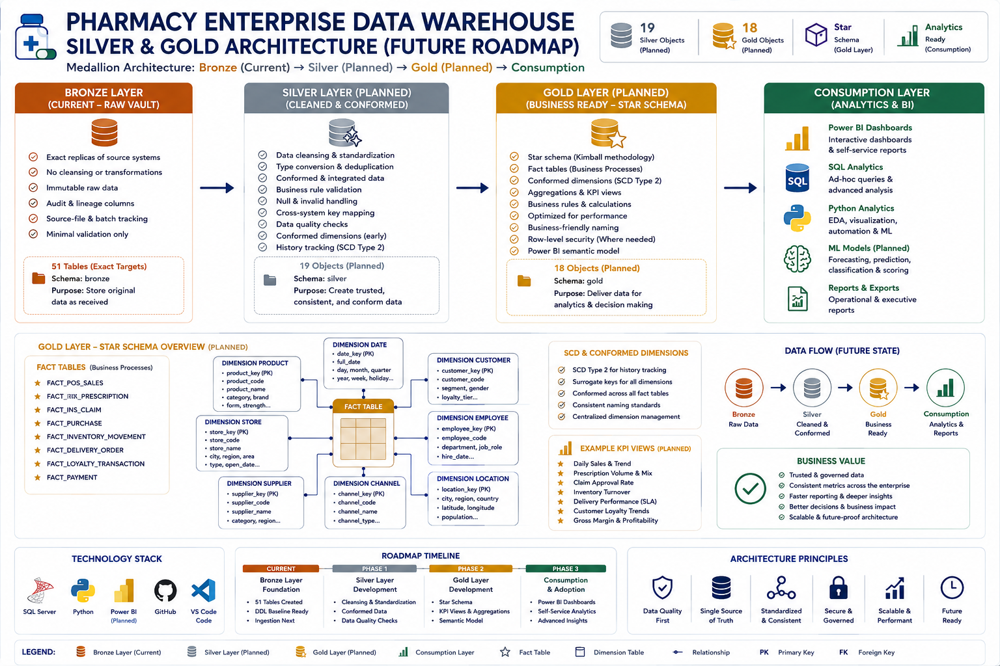
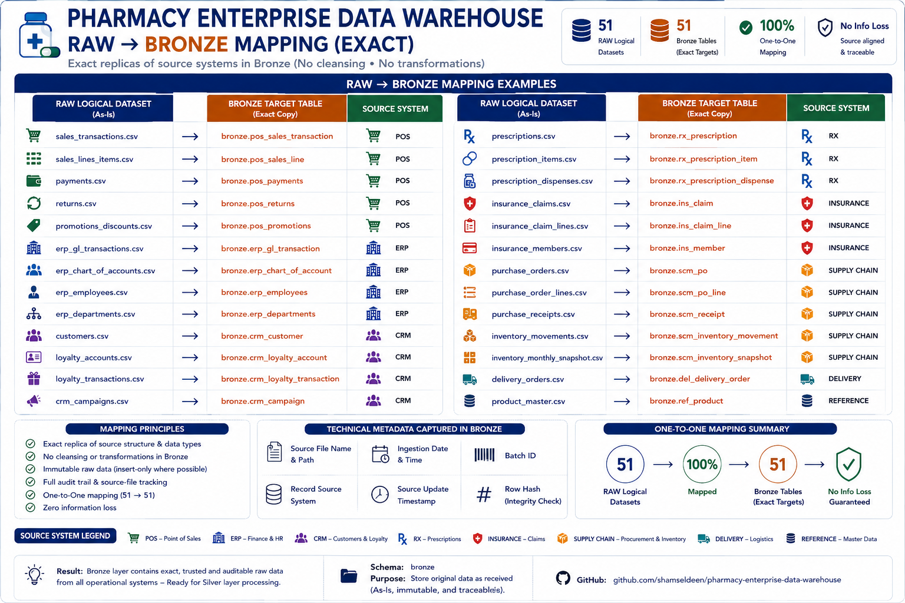
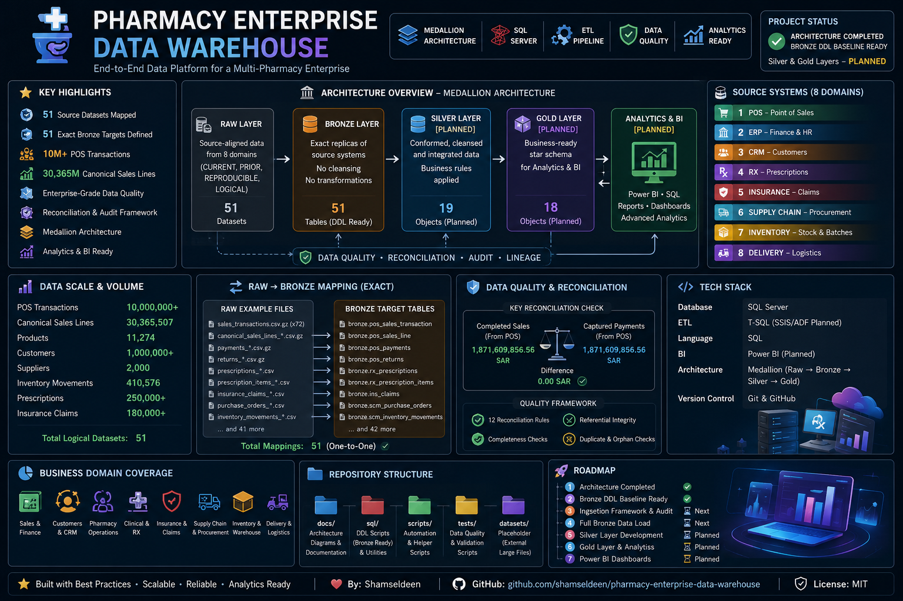
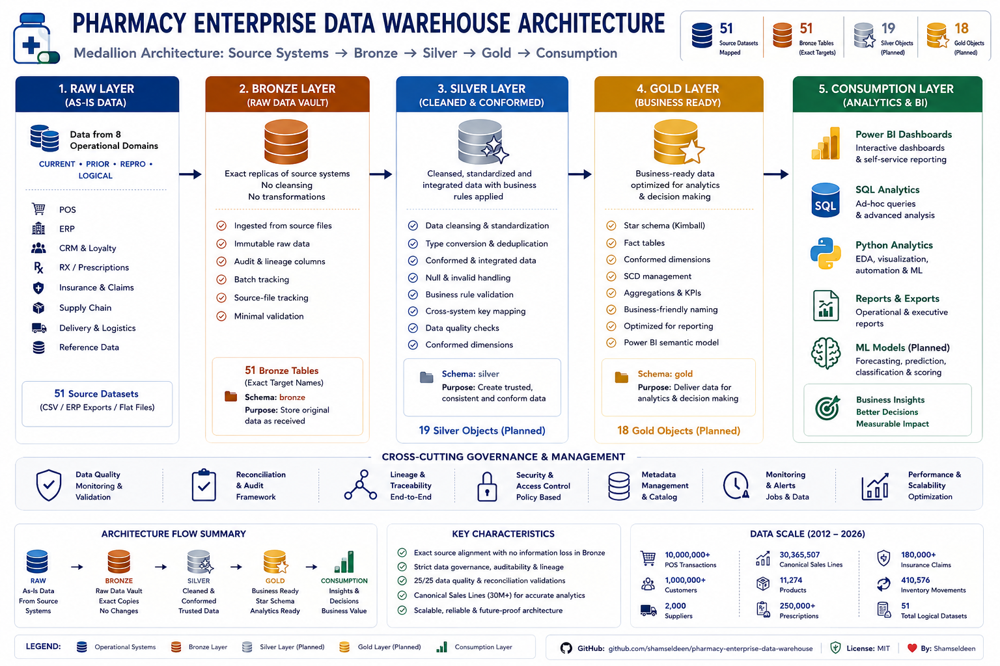
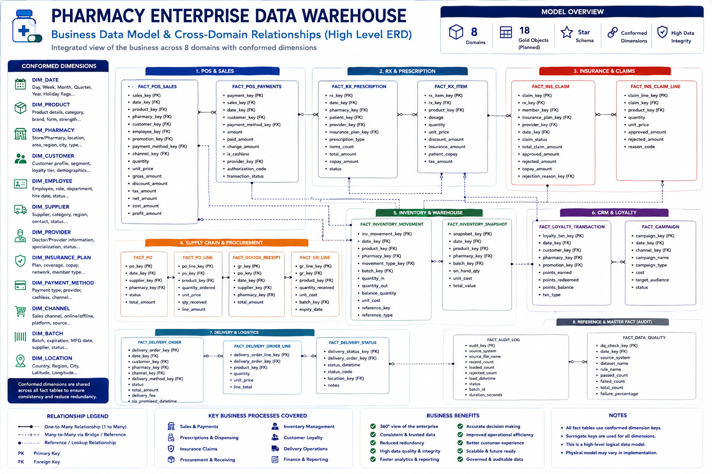
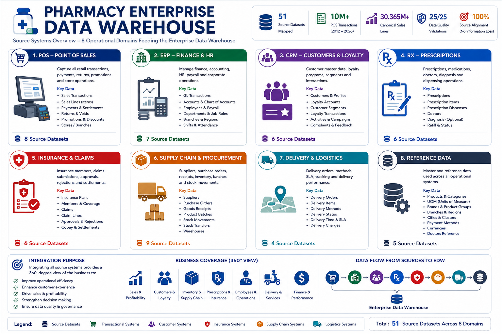
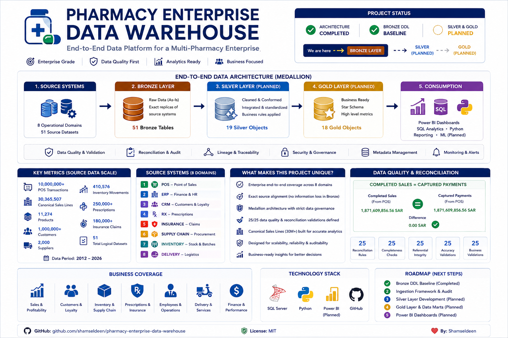
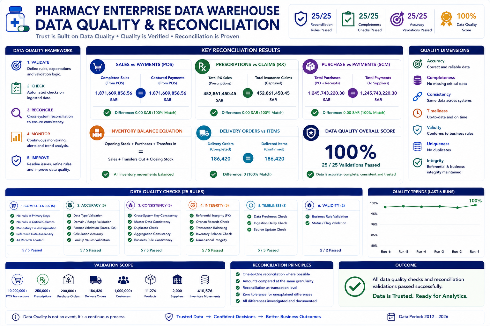

# 💊 Pharmacy Enterprise Data Warehouse

## 📍 Current Project Checkpoint — 2026-10-08

> This section updates the repository snapshot dated 2026-08-30. Fabric results below are evidenced by saved outputs in the WInvalid project notebooks; they were not rerun in Fabric during this documentation review.

### The project journey

1. **Business design and source data.** The project began as a multi-domain pharmacy enterprise warehouse, with a finalized synthetic operational dataset, source catalog, business relationships, and cross-domain validation. The existing repository records 72 source files, 25/25 RAW checks, and a SQL Server Bronze load of 72 tables and 60,234,021 rows. Those remain historical repository claims, not a live SQL Server revalidation in this checkpoint.
2. **Fabric foundation.** The project continued in Microsoft Fabric using the finalized RAW files in OneLake and the `Pharmacy-Enterprise-DW-DEV` workspace with `lh_bronze`. The governing Bronze rule remains one physical RAW CSV to one source-aligned Bronze Delta table. Bronze preserves source fidelity; cleaning, deduplication, conformance, and business corrections belong in Silver.
3. **Fabric Bronze ingestion.** Saved `nb_02_bronze_ingestion_framework` outputs record 72/72 files processed, 72 registered Bronze tables, 60,234,021 RAW rows reconciled to 60,234,021 Bronze rows (difference 0), schema reconciliation PASS, and a 451.24 second pipeline runtime. The saved notebook records the Fabric Bronze Ingestion Gate as PASS.
4. **Bronze Data Quality.** Saved outputs record a completeness profile for `bronze.crm_customer_consent_history` (1,200,051 rows, 7 columns, 0 NULLs in each column), a 72-table completeness run covering 612 column profiles, and 19 columns with at least one NULL. The employee temporal rule returned 0 violations and PASS. These are useful controls, but they do not complete uniqueness, key, referential, domain, business, or cross-domain DQ gates.
5. **Recovery of the last notebook state.** The final visible `nb_02` cell failed with `NameError: name 'bronze_table_names' is not defined` during catalog inventory; its preceding cell succeeded. `nb_03_silver_discovery_contract` independently rediscovers the catalog with `SHOW TABLES IN bronze`, so the later notebook avoids that missing-variable dependency. This does not retroactively fix the failed `nb_02` cell.
6. **Silver discovery, not Silver implementation.** The saved `nb_03` artifact shows nine executed cells. Its readable outputs report 72 Bronze tables, 612 columns, 3 yearly entity groups, and 57 candidate Silver entities. The detailed schema-comparison and column-classification widgets are not readable in the saved preview, so their PASS/drift counts and classification distribution remain unknown. The artifact shows discovery and mapping proposals; no Silver Delta writes or formal, persisted data-contract deliverable are evidenced.

### Current status and exact next action

- **Completed:** Fabric Bronze ingestion gate; initial Bronze completeness profiling; one employee temporal check; Silver source/schema discovery.
- **In progress:** Bronze Data Quality gate and interpretation of the existing Silver discovery evidence.
- **Not evidenced as complete:** full Bronze DQ gate, formal Silver contracts, Silver transformations or Delta outputs, Gold, semantic model, Power BI, orchestration, CI/CD, and portfolio publication.
- **Next:** continue in the existing `nb_03_silver_discovery_contract` notebook. Inspect its saved outputs for the schema comparison cells (cells 5–6), source-to-entity mapping (cell 8), and column classification (cell 9). Record each yearly group’s actual drift result, the classifier counts, and the source-to-candidate mapping. Do not rerun Bronze ingestion. Use those findings to specify and validate the Silver contracts before writing any Silver tables.

### Engineering notes to carry forward

- `Candidate Silver entities: 57` is a discovery count, not 57 implemented Silver tables.
- Do not claim the yearly schemas all pass until the unreadable comparison outputs are inspected.
- Review multiword domain parsing (`supply_chain`) and numeric identifier classification before treating inferred metadata as contract truth.
- Keep NULL findings as profiling evidence; define field-specific rules before deciding whether NULL is acceptable or an exception.
- The old status table and roadmap below describe the repository’s earlier SQL Server checkpoint. Read them as project history; this dated Fabric checkpoint is the current status snapshot.
- The WInvalid conversation supplied one mobile screenshot confirming the pinned project chat. Its direct learning branch supplied the `nb_01_bronze_reference_regions` notebook, its BuiltIn package, and `nb_02_bronze_ingestion_framework`; the `nb_03` artifact was also inspected from ChatGPT Library. These notebook artifacts are not yet committed to this repository.

### Consolidated route to completion

`Finish Bronze DQ and close the Bronze gate` → `inspect discovery evidence and define Silver contracts` → `build and validate Silver transformations` → `design Gold facts/dimensions at explicit grains` → `publish a semantic model` → `build and test Power BI reports` → `automate data tests, monitoring, security, and performance checks` → `add justified orchestration/incremental patterns` → `Git/CI-CD and portfolio documentation`.

---


> **An enterprise-scale retail pharmacy data warehouse project that models the full path from operational source data to governed analytical data using SQL Server, Medallion Architecture, data-quality controls, reconciliation, dimensional modeling, and BI.**

This project is designed as a realistic portfolio implementation rather than a single-dashboard demo. It integrates pharmacy retail operations across **sales, customers, products, prescriptions, insurance, procurement, suppliers, inventory, workforce, branch operations, and delivery** into one analytical platform.



---

## 📌 Project Status

| Area | Status |
|---|---|
| Business scope & source-system design | ✅ Complete |
| Synthetic RAW business dataset | ✅ Complete / locked |
| Cross-domain RAW validation | ✅ 25 / 25 checks passed |
| Metadata & business data catalog | ✅ Complete |
| Architecture, ERD & lineage | ✅ Complete |
| Bronze DDL generation and table creation | ✅ 72 tables created |
| Bronze loading procedure and batch audit | ✅ Implemented |
| RAW → Bronze SQL Server ingestion | ✅ 72 / 72 tables loaded |
| Bronze rows loaded | ✅ 60,234,021 rows |
| Bronze failed tables | ✅ 0 |
| Bronze final validation & reconciliation | ▶️ Next phase |
| Silver layer | ⏳ Planned |
| Gold dimensional layer | ⏳ Planned |
| Power BI semantic model & dashboards | ⏳ Planned |
| Python analytics / forecasting | ⏳ Planned |

**Current milestone:** `RAW → Bronze ingestion complete`

**Next milestone:** `Bronze final validation & reconciliation`

---

## 🎯 Project Objective

The goal is to build a reproducible **enterprise analytical platform for a multi-branch retail pharmacy business**.

The warehouse is intended to support questions such as:

- Which branches, regions, categories, and products drive revenue and profitability?
- How do discounts, returns, and product mix affect margin?
- Which suppliers perform best on fill rate, lead time, and OTIF?
- Where are stockouts, overstock, dead stock, and near-expiry risks concentrated?
- How do prescriptions and insurance claims behave across products, doctors, plans, and branches?
- What customer, workforce, and operational patterns explain branch performance?
- How can trusted warehouse data feed executive Power BI reporting and advanced Python analytics?

---

## 📊 Dataset Scale

The project uses a large synthetic operational dataset designed for realistic warehousing and analytics workloads.

| Dataset | Scale |
|---|---:|
| Product master | **11,274 SKUs** |
| Pharmacy branches | **1,000** |
| Employees | **10,000** |
| Customers | **1,000,000** |
| Doctors | **20,000** |
| Suppliers | **2,000** |
| Warehouses | **30** |
| POS transaction headers | **10,000,000** |
| Completed POS transactions | **9,890,375** |
| Canonical sales lines | **30,365,507** |
| Purchase orders | **25,000** |
| Purchase-order lines | **82,140** |
| Purchase receipts | **80,478** |
| Product batches | **40,000** |
| Inventory movements | **410,576** |
| Prescriptions | **100,000** |
| Prescription items | **203,899** |
| Insurance claims | **75,000** |
| Insurance claim lines | **153,098** |

> **Note:** the 30.3M canonical sales-line fact has been validated and financially reconciled, but the large standalone materialized file is not committed directly to the portable repository. Its materialization rule and validation evidence are documented separately.

---

## 🥉 Bronze Ingestion Milestone

The finalized RAW dataset has been successfully loaded into SQL Server as a source-aligned Bronze layer.

| Metric | Result |
|---|---:|
| Batch ID | `841372319990` |
| Bronze tables | **72** |
| Successful tables | **72** |
| Failed tables | **0** |
| Rows loaded | **60,234,021** |
| Load status | **SUCCESS** |

The ingestion process was executed through a generated SQL Server loading procedure with table-level batch auditing.

The audit records capture:

```text
_batch_id
bronze_table_name
source_domain
relative_file_path
_ingestion_ts
rows_loaded
load_status
error_message
```

The loader completed 71 tables during its main execution. One small CSV containing a quoted comma required an isolated reload using the file's Windows-style `CRLF` row ending:

```sql
ROWTERMINATOR = '0x0D0A'
```

After the isolated reload and audit correction, the final batch reached:

```text
72 / 72 tables
60,234,021 rows
0 failures
```

This milestone confirms successful ingestion. It does **not** yet represent completion of Bronze final validation, key-integrity testing, duplicate analysis, null profiling, or cross-table reconciliation.

---

## 🏗️ Architecture



The project follows a **Medallion Architecture**:

```text
Operational / Synthetic Source Systems
                │
                ▼
              RAW
        source evidence
                │
                ▼
             BRONZE
   source-aligned ingestion + audit
                │
                ▼
             SILVER
 cleaning + standardization + conformance
                │
                ▼
              GOLD
 dimensions + facts + analytical marts
                │
        ┌───────┼────────┐
        ▼       ▼        ▼
     Power BI   SQL     Python
```

### Layer Responsibilities

| Layer | Responsibility |
|---|---|
| **RAW** | Preserve source-system evidence and original business records |
| **Bronze** | Load source-aligned tables with technical metadata and auditability |
| **Silver** | Clean, standardize, validate, deduplicate, and conform business entities |
| **Gold** | Build dimensional models, KPI-ready facts, dimensions, and marts |
| **Consumption** | Power BI, SQL analysis, Python analytics, forecasting |

---

## 🏢 Source Domains



The warehouse is modeled around multiple operational domains instead of one flat sales file.

| Domain | Main Business Data |
|---|---|
| **Reference / Master** | Regions, cities, products, reference codes |
| **ERP / Branch Operations** | Pharmacies, employees, job roles, shifts, operating hours, branch expenses |
| **POS / Finance** | Transactions, sales lines, payments, returns |
| **CRM & Loyalty** | Customers, loyalty accounts, consent history, customer-service interactions |
| **Prescription / RX** | Prescriptions, prescription items, dispensing events, doctors |
| **Insurance** | Insurance plans, memberships, eligibility, claims, claim lines |
| **Supply Chain** | Suppliers, contracts, warehouses, purchase orders, receipts, batches |
| **Inventory** | Inventory movements, snapshots, cycle counts, transfers |
| **Delivery** | Delivery orders and delivery methods |

---

## 🧱 RAW → Bronze Implementation



The finalized RAW structure was materialized into **72 source-aligned Bronze tables** in SQL Server.

The implementation deliberately keeps Bronze close to the source files:

- One source-aligned Bronze table for each finalized RAW file
- Source-domain prefixes in Bronze table names
- Conservative SQL Server datatypes
- No business cleansing or dimensional transformations
- Generated DDL for reproducible table creation
- Generated loading procedure for repeatable ingestion
- Compact table-level batch auditing
- Failure isolation without reloading successful large tables

### Implementation Flow

```text
Finalized RAW CSV files
        ↓
Python Bronze DDL Generator
        ↓
72 SQL Server Bronze tables
        ↓
Python Procedure Generator
        ↓
Generated T-SQL loading procedure
        ↓
BULK INSERT execution
        ↓
Compact batch/file audit
```

### Example Source-to-Bronze Mappings

```text
pos/sales_transactions/sales_transactions_2020.csv
    → bronze.pos_sales_transactions_2020

pos/canonical_sales_lines/canonical_sales_lines_2025_FINAL.csv
    → bronze.pos_canonical_sales_lines_2025_final

pos/payments/payments_2025.csv
    → bronze.pos_payments_2025

reference/products_FINAL_11274.csv
    → bronze.reference_products_final_11274

rx/prescription_items_FINAL.csv
    → bronze.rx_prescription_items_final

supply_chain/purchase_order_lines_FINAL.csv
    → bronze.supply_chain_purchase_order_lines_final
```

### Loader Behavior

The generated loader:

- Loads CSV files into their corresponding Bronze tables
- Uses UTF-8 CSV handling
- Records the batch, table, source file, row count, status, and error message
- Continues loading independent tables when one table fails
- Supports isolated troubleshooting and reload of only the failed table
- Avoids repeating a successful 60-million-row ingestion because of one small failure

For this Windows-generated dataset, the final loader configuration should use:

```sql
ROWTERMINATOR = '0x0D0A'
```

If one table fails, its `BULK INSERT` should be executed separately without `TRY/CATCH` to expose the exact row and column error. The full batch should not be rerun when the other tables have already succeeded.

Bronze remains a source-aligned ingestion layer. Cleansing, standardization, conformance, business-rule enforcement, and dimensional transformations are deferred to Silver.

---

## 🧪 Data Quality & Reconciliation



Data quality is treated as part of the architecture, not as a final dashboard check.

The RAW business model passed **25 / 25 cross-domain validation checks**.

Key controls include:

- Unique product identifiers and barcodes
- Positive product prices
- Referential integrity across key business entities
- Exclusion of cancelled/voided POS sales from canonical revenue
- Completed-sales to captured-payment reconciliation
- Prescription-to-customer / doctor / product validation
- Insurance claim and plan validation
- `approved_amount <= claimed_amount`
- Purchase-order to supplier / warehouse integrity
- Receipt to purchase-order-line integrity
- Product-batch to product / supplier integrity
- Balanced inventory transfer OUT / IN pairs
- Valid inventory snapshot equation
- Non-negative canonical closing inventory

### Financial Reconciliation

```text
Completed sales     = 1,871,609,856.56 SAR
Captured payments   = 1,871,609,856.56 SAR
Difference          =             0.00 SAR
```

This reconciliation is one of the main controls protecting downstream profitability and KPI analysis.

---

## 🔗 Core Business Flow



```text
CUSTOMERS / PHARMACIES / EMPLOYEES
                │
                ▼
        SALES TRANSACTIONS
                │
        ┌───────┼────────┐
        ▼       ▼        ▼
   SALES LINES PAYMENTS RETURNS
        │
        ▼
     PRODUCTS


CUSTOMERS + DOCTORS + PHARMACIES
                │
                ▼
         PRESCRIPTIONS
                │
                ▼
      PRESCRIPTION ITEMS
                │
                ▼
        INSURANCE CLAIMS
                │
                ▼
       INSURANCE CLAIM LINES


SUPPLIERS + WAREHOUSES
                │
                ▼
        PURCHASE ORDERS
                │
                ▼
      PURCHASE ORDER LINES
                │
                ▼
       PURCHASE RECEIPTS
                │
                ▼
      INVENTORY MOVEMENTS
                │
                ▼
      INVENTORY SNAPSHOTS
```

---

## 🥈 Planned Silver Layer



> **Status: PLANNED — not yet implemented.**

The Silver layer will convert source-aligned Bronze tables into trusted, conformed entities.

### Planned Silver Objects

```text
silver.product
silver.customer
silver.pharmacy
silver.employee
silver.doctor

silver.sales_transaction
silver.sales_line

silver.prescription
silver.insurance_member
silver.insurance_claim

silver.supplier
silver.procurement
silver.batch

silver.inventory_movement
silver.inventory_snapshot
```

Silver will own:

- Standardized data types and naming
- Canonical business statuses
- Explicit deduplication rules
- Null and invalid-value treatment
- Conformed entity keys
- Referential validation
- Monetary and date normalization
- Data-quality exception handling

---

## 🥇 Planned Gold Layer

> **Status: PLANNED — not yet implemented.**

The Gold layer will expose business-ready dimensional models.

### Planned Conformed Dimensions

```text
gold.dim_date
gold.dim_pharmacy
gold.dim_product
gold.dim_customer
gold.dim_employee
gold.dim_doctor
gold.dim_supplier
gold.dim_insurance_plan
```

### Planned Analytical Facts

```text
gold.fact_sales
gold.fact_return
gold.fact_prescription
gold.fact_insurance_claim
gold.fact_purchase
gold.fact_inventory_movement
gold.fact_inventory_snapshot
gold.fact_delivery
gold.fact_customer_service
gold.fact_branch_expense
```

The final grain, surrogate-key strategy, SCD handling, and analytical relationships will be fixed during Silver/Gold implementation rather than prematurely enforced in Bronze.

---

## 📈 Business Analytics Coverage

The completed warehouse is designed to support:

| Area | Example Analytics |
|---|---|
| **Executive** | Revenue, profit, growth, margin, regional performance |
| **Sales** | ATV, UPT, product/category mix, discount impact, returns |
| **Branches** | Branch ranking, same-store growth, labor productivity |
| **Products** | Revenue, units, margin, brand/generic mix |
| **Customers** | Retention, frequency, RFM, CLV, loyalty behavior |
| **Inventory** | Stock turnover, DOI, OOS, dead stock, expiry risk |
| **Procurement** | Supplier spend, fill rate, OTIF, lead time |
| **RX** | Prescription volume, dispensing, doctor/product analysis |
| **Insurance** | Approval rate, rejection reasons, payer performance |
| **Workforce** | Sales per employee, labor hours, staffing efficiency |
| **Delivery** | SLA, delivery time, cost per order |
| **Customer Experience** | Complaints, resolution time, service quality |

---

## 🛠️ Technology Stack



| Technology | Purpose |
|---|---|
| **SQL Server** | Enterprise data warehouse |
| **T-SQL** | DDL, ETL/ELT, validation, analytics |
| **SSMS** | SQL Server development |
| **Python** | Data generation, validation, analytics |
| **Pandas** | Data analysis and validation |
| **Power BI** | Planned semantic model and executive dashboards |
| **DAX** | Planned analytical measures |
| **Git / GitHub** | Version control and portfolio delivery |
| **Draw.io / Architecture Diagrams** | ERD, lineage and data-flow design |
| **VS Code** | Development environment |

---

## 📂 Repository Structure

The current GitHub repository contains:

```text
pharmacy-enterprise-data-warehouse/
│
├── datasets/
│   └── placeholder
│
├── docs/
│   ├── architecture/
│   └── placeholder
│
├── scripts/
│
├── sql/
│   ├── setup/
│   ├── bronze/
│   │   ├── ddl_bronze.sql
│   │   └── placeholder
│   ├── silver/
│   └── gold/
│
├── tests/
│
├── LICENSE
└── README.md
```

The repository will expand as the completed Bronze implementation artifacts are reviewed and published, followed by Silver transformations, Gold models, tests, BI assets, and supporting documentation.

Large generated datasets are intentionally stored outside the GitHub repository.

At the current repository state, `datasets/` contains only a placeholder; the warehouse dataset itself is maintained separately.

GitHub is used for SQL, architecture, documentation, tests, scripts, and reproducibility artifacts.

> **Repository note:** the final generated 72-table DDL and Bronze loading procedure were executed locally and are not yet present in the public repository. They will be published after their final source-code review. The ingestion results above describe the completed SQL Server execution, not the current public file inventory.

---

## 🗺️ Project Roadmap

```text
✅ Business requirements & scope
        ↓
✅ Enterprise source-system design
        ↓
✅ Synthetic RAW dataset
        ↓
✅ RAW quality & reconciliation
        ↓
✅ Metadata & data catalog
        ↓
✅ Architecture / ERD / lineage
        ↓
✅ RAW → Bronze source mapping
        ↓
✅ Bronze DDL generation
        ↓
✅ 72 Bronze tables created
        ↓
✅ Bronze loader + batch audit
        ↓
✅ RAW → Bronze ingestion
   72 / 72 tables
   60,234,021 rows
   0 failures
        ↓
▶ Bronze final validation & reconciliation
        ↓
⏳ Silver cleaning & conformance
        ↓
⏳ Gold dimensional model
        ↓
⏳ KPI / analytical SQL layer
        ↓
⏳ Power BI semantic model & dashboards
        ↓
⏳ Kaggle Python analytics / forecasting
```

---

## 📚 Documentation

### Visual Architecture Set

| # | Visual | Purpose |
|---:|---|---|
| **01** | Project Overview | Executive introduction, project scale and status |
| **02** | Source Systems Overview | Operational domains feeding the warehouse |
| **03** | End-to-End Architecture | RAW → Bronze → Silver → Gold → Consumption |
| **04** | RAW → Bronze Mapping | Source-aligned ingestion and technical metadata |
| **05** | Business ERD / Cross-Domain | Core business relationships across domains |
| **06** | Data Quality & Reconciliation | Validation controls and financial/operational gates |
| **07** | Planned Silver & Gold | Future conformed and dimensional architecture |
| **08** | Technology / Repository / Roadmap | Stack, delivery structure and implementation path |

Architecture visuals are stored under:

```text
docs/architecture/
```

The repository will continue to integrate engineering documentation including:

- Business ERD
- Source-to-target mapping
- Metadata and data dictionary
- Business rules
- Data-quality rules
- Reconciliation logic
- Data lineage
- Implementation documentation

---

## ⚠️ Data & Provenance Disclaimer

This is a **portfolio and learning project built on synthetic operational data**.

Some product records may use real-world brand names or standard medicine concepts to improve business realism.

Generated combinations of SKU, barcode, pack, price, transaction, prescription, insurance, customer, employee, supplier, and operational data are synthetic unless explicitly documented otherwise.

The dataset must not be interpreted as an official manufacturer, retailer, payer, or regulatory registry.

---

## 👤 Author

### Shamseldeen Ismaiil

Retail pharmacy professional with more than 10 years of operational experience, building practical expertise in:

**Data Analytics • Business Intelligence • SQL • Python • Power BI • Data Warehousing**

The project combines technical data skills with practical domain understanding across:

**Pharmacy Operations • Retail • Sales • Insurance • Inventory • Customer Service**

---

## 📄 License

This project is released under the [MIT License](LICENSE).

---

### ⭐ Project Vision

> Build a realistic, auditable, and scalable pharmacy analytics platform that demonstrates the complete journey from complex operational data to trusted business intelligence.
